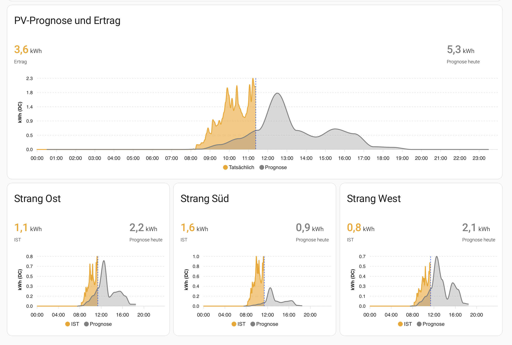

# Solar-Prognose-Card

Home Assistant Dashboard-Cards zur Visualisierung von PV-Prognosen und Echtzeit-Messwerten mit [ApexCharts Card](https://github.com/RomRider/apexcharts-card).

Die Cards zeigen auf einen Blick, wie gut die ML-Prognose mit der tatsächlichen Erzeugung übereinstimmt — sowohl für die Gesamtanlage als auch für einzelne Wechselrichter-Stränge. Sie eignen sich als Vorlage für eigene PV-Dashboards und können an beliebige Anlagen angepasst werden.



## Referenz-Installation

Die Cards sind für folgende Anlage konfiguriert:

| Komponente | Details |
|---|---|
| **Batteriespeicher** | SENEC (7,5 kWh Kapazität) |
| **Wechselrichter** | Piko mit 3 DC-Strängen (Ost / West / Süd) |
| **Prognose-Integration** | [Solar Forecast ML](https://github.com/bremme/home-assistant-solar-forecast-ml) (lokale ML-Prognose) |
| **Alternative Prognose** | [Solcast PV Forecast](https://github.com/BJReplay/ha-solcast-solar) (Cloud-basiert) |

## Cards

| Datei | Beschreibung |
|---|---|
| **Solar_Forecast_ML.yaml** | Gesamtübersicht: Batterie (kWh), Verbrauch, Solarerzeugung (AC) und ML-Prognose |
| **Solcast_PV_Forecast.yaml** | Wie oben, aber mit Solcast-Prognose statt Solar Forecast ML |
| **SFML_Stats_Gesamt.yaml** | Prognose vs. Ertrag: Gesamtanlage (volle Breite) |
| **SFML_Stats_String_Ost.yaml** | Prognose vs. Ertrag: Strang Ost |
| **SFML_Stats_String_West.yaml** | Prognose vs. Ertrag: Strang West |
| **SFML_Stats_String_Sued.yaml** | Prognose vs. Ertrag: Strang Süd |

## Voraussetzungen

- [Home Assistant](https://www.home-assistant.io/) mit [ApexCharts Card](https://github.com/RomRider/apexcharts-card) (HACS)
- [Solar Forecast ML](https://github.com/bremme/home-assistant-solar-forecast-ml) Integration
- SQL-Sensoren (siehe Einrichtung unten)

## Installation

1. YAML-Datei herunterladen
2. Im HA-Dashboard eine neue Card anlegen → "Manuell (YAML)" wählen
3. YAML-Inhalt einfügen
4. Sensoren an die eigene Installation anpassen (siehe [Anpassung an andere Installationen](#anpassung-an-andere-installationen))

## SQL-Sensoren einrichten

Die Cards benötigen SQL-Sensoren, die Daten direkt aus der `solar_forecast.db` von Solar Forecast ML lesen. Diese werden **manuell über die HA-Oberfläche** angelegt (nicht per YAML).

### Gemeinsame Einstellungen

Alle SQL-Sensoren anlegen über **Einstellungen → Geräte & Dienste → Integration hinzufügen → "SQL"**:

| Feld | Wert |
|---|---|
| **Database URL** | `sqlite:////config/solar_forecast_ml/solar_forecast.db` |
| **Column** | `state` |
| **Unit of measurement** | `kWh` |

### Sensor 1: SFML Tagesprognose

Wird von **Solar_Forecast_ML.yaml** verwendet.

**Name:** `SFML Tagesprognose` → Entity: `sensor.sfml_tagesprognose`

**Query:**
```sql
SELECT ROUND(SUM(prediction_kwh), 1) as state, json_group_array(json_object('hour', target_hour, 'kwh', ROUND(prediction_kwh, 3))) as hourly_forecast FROM hourly_predictions WHERE target_date = date('now', 'localtime') ORDER BY target_hour;
```

**Ergebnis:**
- **State** = Tages-Prognosesumme in kWh (z.B. `4.2`)
- **Attribut `hourly_forecast`** = JSON-Array: `[{"hour": 0, "kwh": 0.0}, {"hour": 1, "kwh": 0.0}, ...]`

### Sensor 2: SFML Stats Gesamt

Wird von **SFML_Stats_Gesamt.yaml** verwendet.

**Name:** `SFML Stats Gesamt` → Entity: `sensor.sfml_stats_gesamt`

**Query:**
```sql
SELECT ROUND(COALESCE(SUM(actual_kwh), 0), 2) as state, ROUND(SUM(prediction_kwh), 2) as prediction_total, CASE WHEN COALESCE(SUM(actual_kwh), 0) = 0 AND SUM(prediction_kwh) = 0 THEN 100 WHEN COALESCE(SUM(actual_kwh), 0) = 0 OR SUM(prediction_kwh) = 0 THEN 0 ELSE ROUND(MIN(COALESCE(SUM(actual_kwh), 0), SUM(prediction_kwh)) * 100.0 / MAX(COALESCE(SUM(actual_kwh), 0), SUM(prediction_kwh)), 0) END as accuracy, json_group_array(json_object('hour', target_hour, 'pred', ROUND(prediction_kwh, 4), 'actual', actual_kwh)) as hourly_data FROM (SELECT target_hour, prediction_kwh, actual_kwh FROM hourly_predictions WHERE target_date = date('now', 'localtime') ORDER BY target_hour);
```

**Ergebnis:**
- **State** = IST-Summe in kWh
- **Attribut `prediction_total`** = Prognose-Summe in kWh
- **Attribut `hourly_data`** = JSON-Array: `[{"hour": 0, "pred": 0.0, "actual": null}, ...]`

### Sensor 3: SFML Stats String Ost

Wird von **SFML_Stats_String_Ost.yaml** verwendet.

**Name:** `SFML Stats String Ost` → Entity: `sensor.sfml_stats_string_ost`

**Query:**
```sql
SELECT ROUND(COALESCE(SUM(actual_kwh), 0), 3) as state, ROUND(SUM(prediction_kwh), 3) as prediction_total, CASE WHEN COALESCE(SUM(actual_kwh), 0) = 0 AND SUM(prediction_kwh) = 0 THEN 100 WHEN COALESCE(SUM(actual_kwh), 0) = 0 OR SUM(prediction_kwh) = 0 THEN 0 ELSE ROUND(MIN(COALESCE(SUM(actual_kwh), 0), SUM(prediction_kwh)) * 100.0 / MAX(COALESCE(SUM(actual_kwh), 0), SUM(prediction_kwh)), 0) END as accuracy, json_group_array(json_object('hour', target_hour, 'pred', ROUND(prediction_kwh, 4), 'actual', actual_kwh)) as hourly_data FROM (SELECT hp.target_hour as target_hour, ppg.prediction_kwh as prediction_kwh, ppg.actual_kwh as actual_kwh FROM hourly_predictions hp JOIN prediction_panel_groups ppg ON hp.prediction_id = ppg.prediction_id WHERE hp.target_date = date('now', 'localtime') AND ppg.group_name = 'Gruppe 1' ORDER BY hp.target_hour);
```

### Sensor 4: SFML Stats String West

**Name:** `SFML Stats String West` → Entity: `sensor.sfml_stats_string_west`

**Query:** Gleich wie Sensor 3, aber `ppg.group_name = 'Gruppe 2'`

### Sensor 5: SFML Stats String Sued

**Name:** `SFML Stats String Sued` → Entity: `sensor.sfml_stats_string_sued`

**Query:** Gleich wie Sensor 3, aber `ppg.group_name = 'Gruppe 3'`

### Verifikation

Unter **Entwicklerwerkzeuge → Zustände** nach dem Sensor-Namen suchen und prüfen, ob State und Attribute korrekt befüllt sind.

## Anpassung an andere Installationen

Die Cards verwenden Sensoren, die spezifisch für die Referenz-Installation sind. Hier die nötigen Anpassungen:

### Batterie- und Leistungssensoren ersetzen

| Sensor in den YAMLs | Funktion | Anpassung |
|---|---|---|
| `sensor.senec_battery_charge_percent` | Batterie-SOC in % | Eigenen Batterie-SOC-Sensor eintragen. `transform` anpassen: `return x * KAPAZITÄT / 100;` (statt `7.5`) |
| `sensor.senec_house_power` | Hausverbrauch in W | Eigenen Verbrauchssensor eintragen (muss W liefern) |
| `sensor.senec_solar_generated_power` | PV-Gesamtleistung in W (AC) | Eigenen AC-Leistungssensor eintragen |

### Wechselrichter-Stränge (DC)

| Sensor in den YAMLs | Funktion | Anpassung |
|---|---|---|
| `sensor.piko_wechselrichter_dc_1_power` | DC-Leistung Strang Ost | Eigenen DC-String-Sensor eintragen |
| `sensor.piko_wechselrichter_dc_2_power` | DC-Leistung Strang West | Eigenen DC-String-Sensor eintragen |
| `sensor.piko_wechselrichter_dc_3_power` | DC-Leistung Strang Süd | Eigenen DC-String-Sensor eintragen |

Bei mehr oder weniger als 3 Strängen: Strang-Cards entsprechend duplizieren oder entfernen.

### Tagesertrags-Sensoren (Header-Werte)

| Sensor in den YAMLs | Funktion | Anpassung |
|---|---|---|
| `sensor.sfml_pv_gesamt_yield_daily` | Tagesertrag gesamt | Eigenen Tagesertrags-Sensor (kWh) eintragen |
| `sensor.sfml_pv_ost_yield_daily` | Tagesertrag Strang Ost | Eigenen Strang-Ertrags-Sensor eintragen |
| `sensor.sfml_pv_west_yield_daily` | Tagesertrag Strang West | Eigenen Strang-Ertrags-Sensor eintragen |
| `sensor.sfml_pv_sued_yield_daily` | Tagesertrag Strang Süd | Eigenen Strang-Ertrags-Sensor eintragen |
| `sensor.sfml_pv_gesamt_yield_daily` | Tagesertrag (in Solar_Forecast_ML.yaml) | Eigenen Tagesertrags-Sensor eintragen |

### Panel-Gruppen in SQL-Queries

Die Gruppennamen in den SQL-Queries (`Gruppe 1`, `Gruppe 2`, `Gruppe 3`) entsprechen der Konfiguration in Solar Forecast ML. Wenn die eigene Installation andere Gruppennamen verwendet, die Queries entsprechend anpassen:

```sql
-- Eigene Gruppennamen prüfen:
SELECT DISTINCT group_name FROM prediction_panel_groups;
```

### Batterie-Kapazität

In **Solar_Forecast_ML.yaml** wird der SOC (%) in kWh umgerechnet:

```yaml
transform: return x * 7.5 / 100;
```

Den Wert `7.5` durch die eigene Batterie-Kapazität in kWh ersetzen.

### Keine Batterie vorhanden?

Die Batterie-Serie aus Solar_Forecast_ML.yaml / Solcast_PV_Forecast.yaml einfach löschen.

### AC vs. DC

- **Solar_Forecast_ML.yaml** zeigt AC-Werte (nach dem Wechselrichter) — Y-Achse: `kWh (AC)`
- **SFML_Stats_*.yaml** zeigen DC-Werte (vor dem Wechselrichter) — Y-Achse: `kWh (DC)`

DC-Werte sind ca. 3–5 % höher als AC-Werte (Wechselrichter-Verluste). Falls nur AC-Sensoren vorhanden sind, können alle Cards mit AC-Sensoren betrieben und die Achsenbeschriftung auf `kWh (AC)` geändert werden.

## Farbschema und Aufbau

Alle Cards verwenden ein einheitliches Farbschema:

| Farbe | Bedeutung |
|---|---|
| **Orange** | Erzeugung / IST-Messwerte |
| **Grau (gestrichelt)** | Prognose |
| **Grün** | Batterie-Ladezustand |
| **Rot** | Hausverbrauch |
| **Blau (vertikale Linie)** | Aktuelle Uhrzeit |

Jede Card besteht aus:
- **Chart-Serien** — Kurven auf dem Diagramm (Messwerte als durchgezogene Fläche, Prognose als gestrichelte Fläche)
- **Header-Serien** — Kennzahlen im Kartenkopf (IST-Summe, Prognose-Summe), ohne Darstellung im Chart

Die Prognose-Daten werden per `data_generator` aus den JSON-Attributen der SQL-Sensoren gelesen. Echtzeit-Messwerte nutzen die HA-History mit 5-Minuten-Mittelwerten.

## Lizenz

Dieses Projekt steht frei zur Verfügung. Nutzung und Anpassung für eigene PV-Installationen ist ausdrücklich erwünscht.
